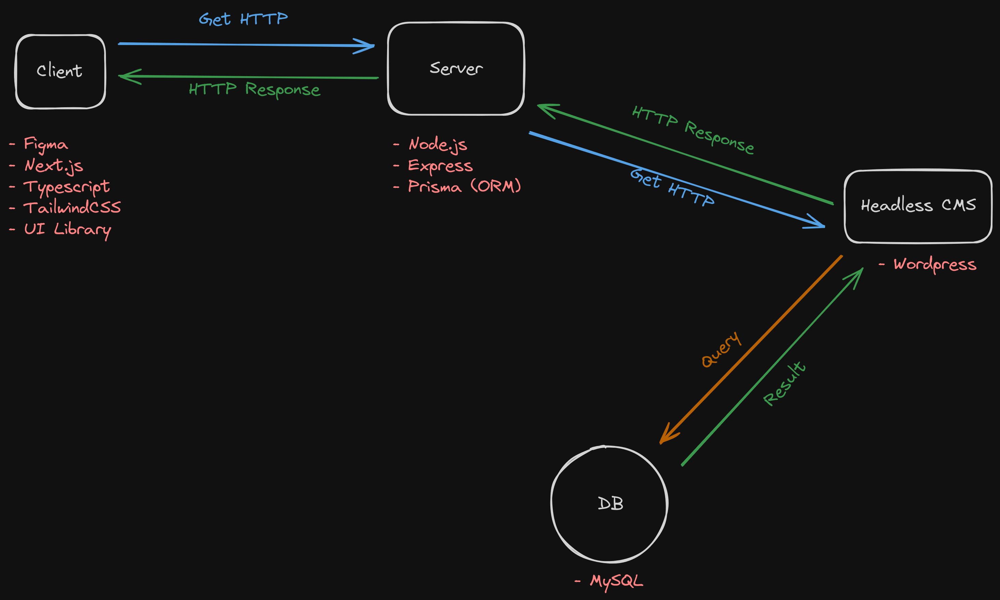

# Blog
This is very simple basic Blog, implemented using the following Tech Stack:  

### Frontend
- Next.js  
- Typescript  
- Prisma  

### Backend
- Express    
- Node.js  
- Wordpress (Headless CMS)  
- MySQL  

### DevOps
- Docker  

## Blog System Design
A high-level system design of the blog:

## References
